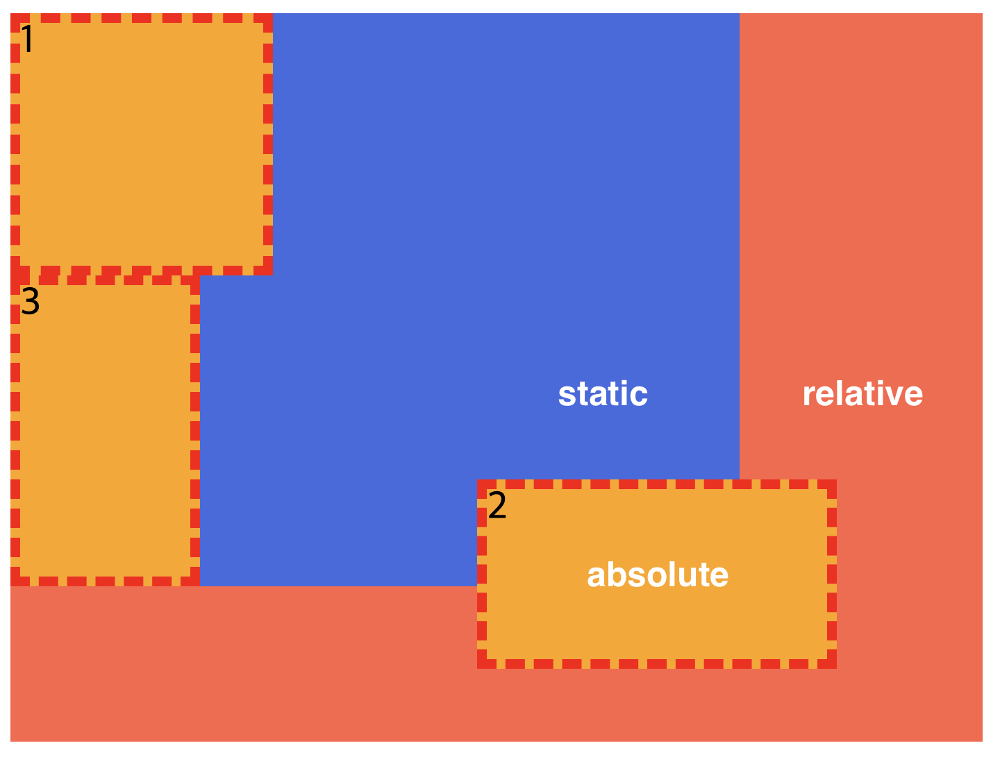

# 전역속성 [Global Attribute]

```html
 <!DOCTYPE html>
 <html lang="ko">

 <head>
   <meta charset="UTF-8">
   <meta http-equiv="X-UA-Compatible" content="IE=edge">
   <meta name="viewport" content="width=device-width, initial-scale=1.0">
   <title>Document</title>
   <link rel="stylesheet" href="https://cdn.jsdelivr.net/npm/reset-css@5.0.1/reset.min.css">
   <link rel="stylesheet" href="/css/main.css">
   <script src="/js/main.js"></script>
 </head>

 <body>
   <div data-fruit-name="apple">사과</div>
   <div data-fruit-name="banana">바나나</div>
 </body>

 </html>
```
<br>

```javascript
const els = document.querySelectorAll('div');

els.forEach(el => {
  console.log(el.dataset.fruitName);
})
```

<pre>
위에 저렇게 HTML과 JS 코드가 있는데, 저대로 실행하면 console에서 확인할 수 있듯이 출력이 되질 않는다.
이유는 html은 하향식으로 읽어내려가기 때문에, head 태그 안에 script 태그를 만나게되면 자바스크립트가 실행되는 시점에 HTML 파싱은 멈추게되고, JS를 먼저 실행하고 파싱을 이어나가기 때문이다.  
그렇게 되면 div는 아직 파싱이 안되었기때문에 당연히 출력이 될일이 없는 것이다. 
</pre>

```html
<script defer src="/js/main.js"></script>
```
>div는 아직 없기때문에 출력이 안된다. 이럴 경우에는 defer 라는 속성을 넣어주거나 script는 바디태그 끝나기 바로 전으로 옮기면 된다. <br>defer 라는 속성은 넣어주면 html 파싱이 끝나고나서 javascript를 실행해준다. 


<br>
<br>

# CSS 선언 방식

```html
<style>
  div{
    color: orange;
    margin: 20px;
  }
</style>

// HTML Head태그안에 작성하는 방법, 파일이 따로 필요없지만 작업이 커지면 안좋아짐.
// 유지보수가 쉽지않음.

<div style="color: orange; margin: 20px;"></div>

// 요소에 직접 스타일을 작성하는 방식, 우선순위가 1순위이기 때문에 관련해서 문제가 있다.
// 유지보수가 쉽지않음.

<link rel="stylesheet" href="/css/main.css">

// link태크로 외부 css 문서를 가져와 연결하는 방식 

<link rel="stylesheet" href="/css/main.css"> 

// @import 방식으로 CSS 문서 안에서 또 다른 CSS 문서를 가져와 연결하는 방식이다. 
// main.css 문서안에 @import  url(./box.css); 이런식으로 가져온다.
```

<br>
<br>


# 선택자 가상클래스 [pseudo-classes]

:foucs가 될 수 있는 요소는 HTML 대화형 컨텐츠인 INPUT, A, BUTTON, LABEL, SELECT 등이 있는데, 다른 요소들 또한 tabindex 라는 속성을 사용해서 :focus효과를 가질 수 있다는걸 알게되었다. 


```html
<div class="box" tabindex="-1"></div>
```

게시판같은거 클릭할 때 하이라이트 되게끔할때 좋을거 같다.

.className *:nth-child(2n)  ->  className이라는 클라스를 가진 요소 짝수번째 자식 요소 모조리 선택한다.<br>그 외 n을 잘 활용해 여러 번째 요소 선택 가능하다.

<br>

# 스타일 강제 상속 [Inheritance]

```html
<div class="parent">
    <div class="child"></div>
  </div>
```

```css
.parent{
  width: 300px;
  height: 200px;
  background-color: orange;
}

.child{
 width: 100px;
 height: inherit;
 background-color: inherit;
 position:fixed;
 top:100px;
 right:10px;
}
```

 이런식으로 속성 값에 inherit을 넣어주면, 부모 요소 스타일을 상속받아 사용한다. 

<br>
<br>

 # 배경 [Background]

 background-attachment: fixed; 를 하게되면 배경이미지가 고정되고, 스크롤해도 해당 이미지는 고정되어 같이 올라가지않는다. 

 <br>
 <br>

 # 배치 [Arrangement]

 <pre>
Position : relative : 자기자신의 요소를 기준으로 좌표이 적용됨
position : static : 좌표값에 대한 영향을 받거나 주지 않음 
position : absolute : relative를 가지고 있는 부모 요소를 기준으로 자표가 적용됨. 
position : fixed : 뷰포트를 기준으로 좌표값이 적용된다.  </pre>

```html
  <div class="wrap">
    <div class="container">
      <div class="item">1</div>
      <div class="item">2</div>
      <div class="item">3</div>
    </div>
  </div>
```

```css
.wrap{
  width: 400px;
  height: 300px;
  background-color: tomato;
  position: relative;
}

.container{
  width:300px;
  background-color: royalblue;
}

.container .item{
  border: 4px dashed red;
  background-color:orange;
}

.container .item:first-child{
  width: 100px;
  height: 100px;
}

.container .item:nth-child(2){
  width: 140px;
  height: 70px;
  position:absolute;
  bottom:30px;
  right:60px;
}

.container .item:last-child{
  width: 70px;
  height: 120px;
}
```




>2라는 박스 position:absolute 속성을 가지고 있고 파란색 박스의 자식요소지만 파란색 박스의 속성이 position:static 이니까 더 위에 부모요소인 토마토색 박스의 속성이 position:relative로 되어있으니 그 기준으로 좌표값을 먹게된다.

<br>
<br>

# 요소 쌓임 순서 [Stack Order]

<pre>
1. 요소에 position 속성의 값이 있는 경우 위에 쌓임. ( static 제외 )
2. 1번 조건이 같은 경우 , z-index 속성의 숫자 값이 높을 수록 위에 쌓임.
3. 1번과 2번 조건이 같은 경우, HTML의 다음 구조일 수록 위에 쌓임.
</pre>

