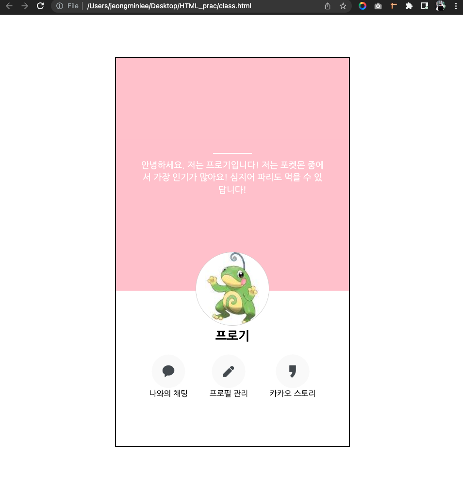

# Today I learned.. 
  ### - Javascript Class Concept 
  ### - Javascript Data
  ### - HTML & CSS Recap

 
 

## Javascript Class Concept 
> [Class Concept 정리한 글](https://evan6-6.tistory.com/19?category=1067381)

 

## Javascript Data
> [Javascript Data 정리한 글](https://evan6-6.tistory.com/20)

 

## HTML & CSS Recap from the beginning
> [김준태님의 수업 자료](https://mango-tower-9f1.notion.site/FastCampus-1-e6550b8460bb4fa69c9ad8561dc90908#01ef6d896def4eb4b66d0cd7c32f45a5)

- HTML 태그에 대해 숙지
- 기본적인 CSS 문법 숙지 

<pre>
간단한 웹의 기본적인 원리와 많이 쓰이는 HTML tag들,
그리고 CSS의 기초지식들인 
<ol><li> style, link Tag</li><li> HTML 선택자</li><li> 속성의 상속</li><li> 복합 선택자</li></ol>외 여러 관련 문법을 배우고 실습을 진행함.
</pre>

### 실습 과제
 
