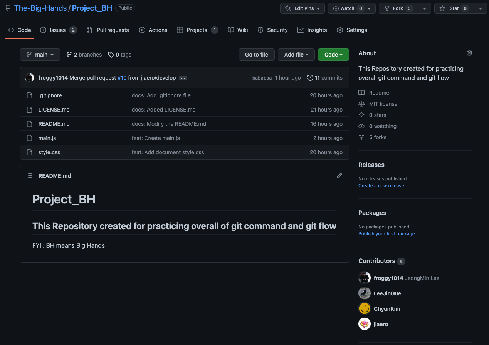

# Today I learned.. 
  ### - Git Project & Git Flow 
  ### - Group meeting 
 
 

# Group meeting

 

> ## [Weekly We Learned](https://www.notion.so/6-27-7-7-83b661c5d3a64c97a9946c47ebaca90e)

  
  
  

# Git Project & Git Flow - [Blog](https://evan6-6.tistory.com/25)

 

 ## 1. Git Branch 
  - creat
  - checkout
  - restore
  - switch
  - delete
  - diffrence checking 

 

 ## 2. Git Branch Models
 - git flow
 - github flow
 - gitlab flow

 

  ## 3. Git flow 
  ### - [Git-flow Official Website](https://danielkummer.github.io/git-flow-cheatsheet/index.ko_KR.html)
   
  

 

  ## 4. Git tips 
  - Reset, Revert commit
  - rename files 
  
  

  ## 5. Git project with teammates

  

 
 

