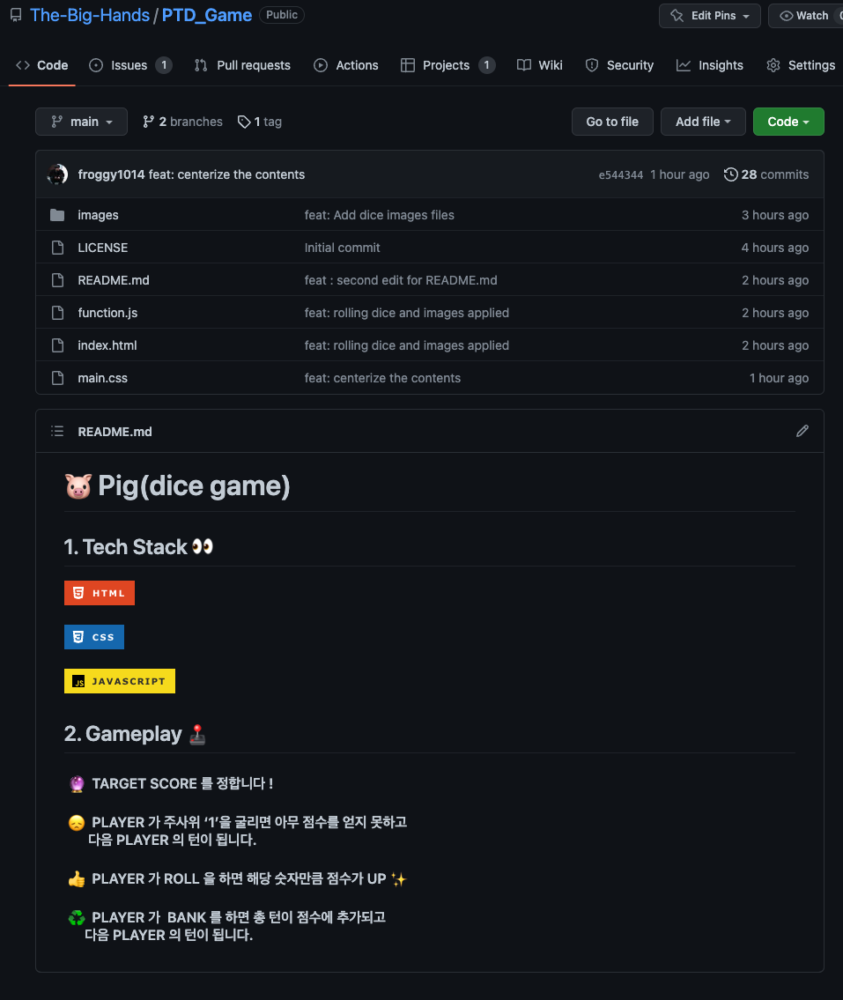

# Today I learned.. 
  ### - Git Flow Project 
  ### - Create DeepDive Study Repository
 
 

# Git Flow Project 

 

> ## [Git Flow - Blog](https://evan6-6.tistory.com/26)

  
  

  
  

# [Create DeepDive Study Repository](https://github.com/KDT-STFE/DeepDive_Study)

 

 ## - Had a meeting with all members, How to study forward

 
 

